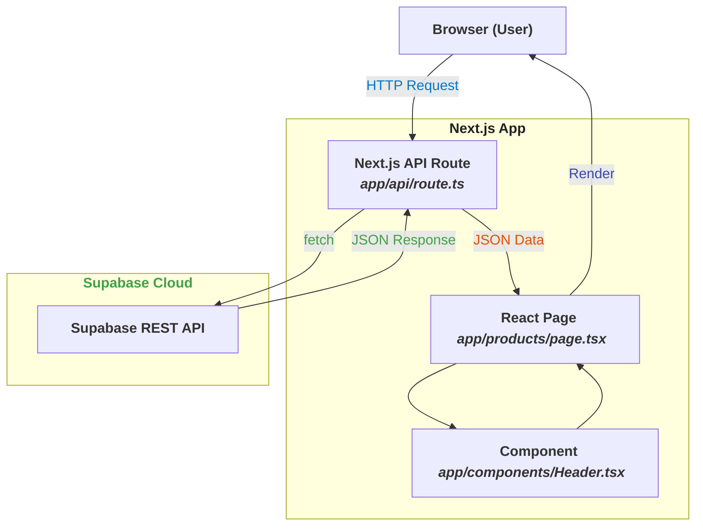

```mermaid
flowchart TD
        A["<b style='color:#fff;background:#007acc;padding:2px 8px;border-radius:4px;'>Browser (User)</b>"]
        B["<b style='color:#fff;background:#222;padding:2px 8px;border-radius:4px;'>Next.js API Route<br/><i>app/api/route.ts</i></b>"]
        C["<b style='color:#fff;background:#43a047;padding:2px 8px;border-radius:4px;'>Supabase REST API</b>"]
        D["<b style='color:#fff;background:#e65100;padding:2px 8px;border-radius:4px;'>React Page<br/><i>app/products/page.tsx</i></b>"]
        E["<b style='color:#fff;background:#3949ab;padding:2px 8px;border-radius:4px;'>Component<br/><i>app/components/Header.tsx</i></b>"]

        A -->|<span style='color:#007acc;'>HTTP Request</span>| B
        B -->|<span style='color:#43a047;'>fetch</span>| C
        C -->|<span style='color:#43a047;'>JSON Response</span>| B
        B -->|<span style='color:#e65100;'>JSON Data</span>| D
        D -->|<span style='color:#3949ab;'>Render</span>| A
        D --> E
        E --> D

        subgraph "<b style='color:#222;'>Next.js App</b>"
            B
            D
            E
        end

        subgraph "<b style='color:#43a047;'>Supabase Cloud</b>"
            C
        end
```
