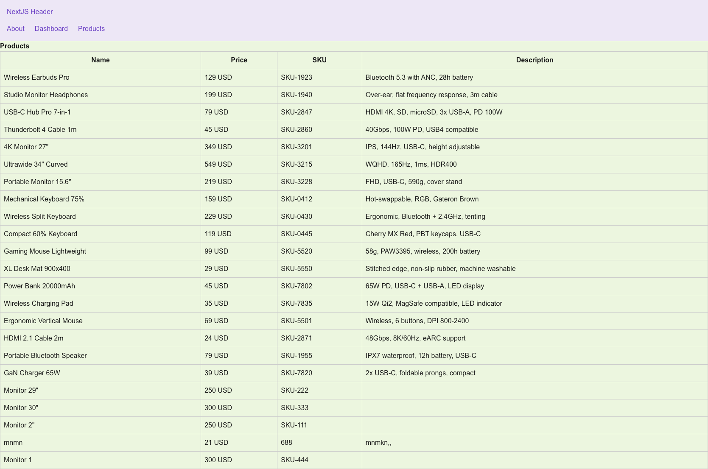
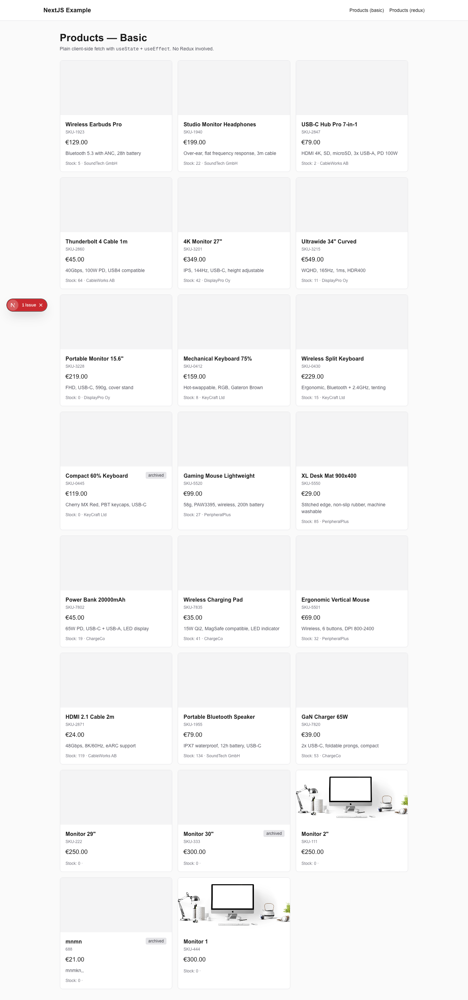

# Next.js Example

## Project Description

This is a demo Next.js application showcasing a modern web app structure using the Next.js App Router. The project demonstrates:

- Ready for deployment on Vercel or other platforms

## Live Demo

The application is deployed and available at: [https://nextjs-example-peach.vercel.app](https://nextjs-example-peach.vercel.app)

## GitHub Repository

Source code and project updates: [https://github.com/1967cooder/nextjs-example](https://github.com/1967cooder/nextjs-example)

- Multi-page navigation (Home, About, Dashboard, Products, Presentations, Demos)
- Modular file-based routing with layouts and nested routes
- Example API route for backend logic
- Integration of custom React components and CSS modules
- Usage of vectorization and RAG (Retrieval-Augmented Generation) demo pages
- Ready for deployment on Vercel or other platforms

The application is intended as a template or learning resource for building scalable, production-ready Next.js apps with best practices.

## Screenshots

Redux Products Page:


# Next.js Example

This project is built with [Next.js](https://nextjs.org) using [`create-next-app`](https://nextjs.org/docs/app/api-reference/cli/create-next-app).

## Getting Started

1. Install dependencies:

```bash
npm install
```

2. Start the development server:

```bash
npm run dev
```

3. Open [http://localhost:3000](http://localhost:3000) in your browser.

You can edit the main page in `app/page.tsx`. Changes are applied automatically.

This project uses [`next/font`](https://nextjs.org/docs/app/building-your-application/optimizing/fonts) to automatically optimize and load the [Geist](https://vercel.com/font) font.

## Features

### State Management with Redux

This project includes a **Redux store** implementation using `@reduxjs/toolkit` for centralized state management:

- **Redux Store Configuration**: Core store setup in `lib/store.ts`
- **Product Slice**: Redux slice for managing products state in `lib/features/products/productsSlice.ts`
  - `fetchProducts` async thunk for API calls
  - `productSelected` / `productDeselected` actions for selection
- **Custom Hooks**: Typed Redux hooks in `lib/hooks.ts` (useAppDispatch, useAppSelector, useAppStore)
- **StoreProvider**: Client-side wrapper component for Redux Provider integration

#### Products Page (Redux)

- Route: `/products/redux`
- State lives in the Redux store
- Uses `fetchProducts` as a `createAsyncThunk`
- Selection is handled via sync actions
- Open Redux DevTools to watch actions flow

#### Products Page (Basic)

- Route: `/products/basic`
- Plain client-side fetch with `useState` and `useEffect`
- No Redux involved (for comparison)

### API Data Structure

- Products are fetched from Supabase via `/api/products`
- Current dataset: **23 products** (2 with images, 21 without)
- Available product images are stored in Supabase Storage

## Screenshots

Products Page:


Redux Products Page:


## Recent Updates (April 24, 2026)

- ✅ Fixed React 19 ref access error in StoreProvider by replacing `useRef` with lazy `useState`
- ✅ Integrated Redux Toolkit for state management
- ✅ Created product slice with async thunk for API integration
- ✅ Implemented Redux DevTools support
- ✅ Added comparison between Redux and basic state management approaches

## Check with keep

To verify everything works correctly, run:

```bash
npx keep
```

or if you have keep installed globally:

```bash
keep
```

This will run an automatic check of the project.

---

## Learn More

To learn more about Next.js, take a look at the following resources:

- [Next.js Documentation](https://nextjs.org/docs) - learn about Next.js features and API.
- [Learn Next.js](https://nextjs.org/learn) - an interactive Next.js tutorial.

You can check out [the Next.js GitHub repository](https://github.com/vercel/next.js) - your feedback and contributions are welcome!

## Deploy on Vercel

The easiest way to deploy your Next.js app is to use the [Vercel Platform](https://vercel.com/new?utm_medium=default-template&filter=next.js&utm_source=create-next-app&utm_campaign=create-next-app-readme) from the creators of Next.js.

Check out our [Next.js deployment documentation](https://nextjs.org/docs/app/building-your-application/deploying) for more details.

12. Contacts

[Portfolio](https://portfolio-react-silvana.netlify.app/)
